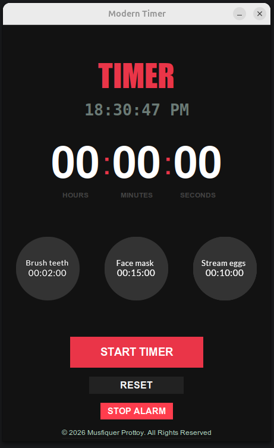

# Modern Digital Timer

A sleek, dark-themed digital timer application built with Python and Tkinter. Featuring a minimalist, borderless UI with real-time clock integration, preset timers, and audio alerts.


## ✨ Features

- **Minimalist Design:** Totally borderless UI with a high-contrast dark theme.
- **Interactive Elements:** Hover animations and hand cursors for a modern feel.
- **Custom Presets:** Quick-access buttons for common tasks (Brushing, Face Wash, Eggs).
- **Live Clock:** Real-time digital clock display.
- **Audio Alerts:** Built-in alarm system using the `just_playback` library.
- **Smart Logic:** Prevents multiple timer instances and includes a full reset feature.

## 📸 Preview
> 

## 🚀 Getting Started

### Prerequisites

- **Python 3.x**
- **Tkinter** (usually comes with Python)
- **just_playback** library

### Installation

1. **Clone the repository:**
   ```bash
   git clone [https://github.com/musfiquerprottoy/Timer-App]
   
2. **Setup a virtual Environment**

# Create and activate venv
python3 -m venv .venv
source .venv/bin/activate

# Install dependencies
pip install just_playback

3. **Running the Application**

Ensure your virtual environment is active, then run:
Bash

python app.py

🛠️ Built With

    Python - Core logic.

    Tkinter - GUI framework for the borderless interface.

    just_playback - Specialized library for low-latency audio.

📂 Project Structure
Plaintext

.
├── app.py            # Main application script
├── Timer_App_SS.png  # Application screenshot
├── alarm.mp3         # Alert sound file
├── brush.png         # Icon for 2-min preset
├── face.png          # Icon for 5-min preset
├── eggs.png          # Icon for 10-min preset
└── README.md         # Project documentation

🤝 Contributing

This is an open-source project. Feel free to fork the repository, open issues, or submit pull requests to improve the UI or add new features!

Developed with ❤️ by Prottoy
